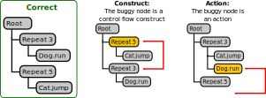
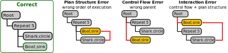
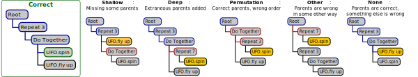

# Supplemental materials

## Bug type dimensions by example

### Dimension 1: Type of buggy node

### Dimension 2: Error type

### Dimension 3: Parenting error subtype

## Possible bug types

Not all combinations of dimensions are possible. Specifically, a **Plan Structure** error never has a parenting error subtype, since there is no parenting error; and conversely, an **Interaction** error always has a parenting error subtype, since there is necessarily some kind of parenting problem present.

The table below summarizes which combinations of **Error type** and **Parenting error subtype** are possible. This applies to errors on both **Action** and **Costruct** nodes, making a total of 20 possible combinations.

|  | Shallow | Deep | Permutation | Other | None |
|--|:-------:|:----:|:-----------:|:-----:|:----:|
| **Plan Structure** | | | | | :white_check_mark: |
| **Control Flow** | :white_check_mark: | :white_check_mark: | :white_check_mark: | :white_check_mark: | :white_check_mark: |
| **Interaction** | :white_check_mark: | :white_check_mark: | :white_check_mark: | :white_check_mark: | |

## TODO
- Features in current state
- temporal pattern specifics and examples
  - We further distinguished between intervals of time when \textbf{one} instance of a bug type was present and intervals where \textbf{multiple} bugs of that same type was present.  
  - Two intervals may \textbf{overlap} in time, \textbf{meet}(one starts exactly when the other ends), or be completely disjoint, with the first interval occurring \textbf{before} the other one.
  - For classification tasks, the training data for each class is typically mined separately to extract temporal patterns that are common to that class. This allows for extracting patterns that are common in one class, but rare in the other class: such patterns are likely to be important features for distinguishing between the classes. 
- ROC/AUC and reasoning for more bespoke evaluation
- Discussion/feature importance
