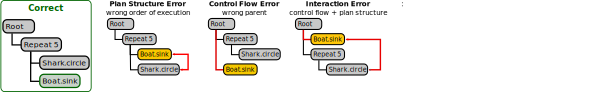

# Supplemental materials

- bug classification examples
  - The examples in figure 1 are representative examples of puzzles given to students, though in some cases abbreviated.
- 20 bug types table
- Features in current state
- temporal pattern specifics and examples
  - We further distinguished between intervals of time when \textbf{one} instance of a bug type was present and intervals where \textbf{multiple} bugs of that same type was present.  
  - Two intervals may \textbf{overlap} in time, \textbf{meet}(one starts exactly when the other ends), or be completely disjoint, with the first interval occurring \textbf{before} the other one.
  - For classification tasks, the training data for each class is typically mined separately to extract temporal patterns that are common to that class. This allows for extracting patterns that are common in one class, but rare in the other class: such patterns are likely to be important features for distinguishing between the classes. 
- ROC/AUC and reasoning for more bespoke evaluation
- Discussion/feature importance
