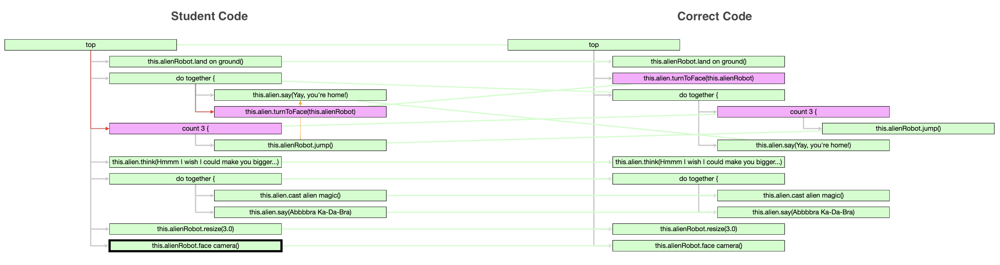

# Supplemental materials

## Table of Contents
  * [Bug type dimensions by example](#bug-type-dimensions-by-example)
    + [Dimension 1: Type of buggy node](#dimension-1--type-of-buggy-node)
    + [Dimension 2: Error type](#dimension-2--error-type)
    + [Dimension 3: Parenting error subtype](#dimension-3--parenting-error-subtype)
  * [Possible bug types](#possible-bug-types)
  * [Features for predictive models](#features-for-predictive-models)
    + [Current state features](#current-state-features)
    + [Temporal patterns](#temporal-patterns)
      - [Example temporal patterns](#example-temporal-patterns)
        * [Example 1: meets](#example-1--meets)
        * [Example 2: overlaps](#example-2--overlaps)
        * [Example 3: complex repetition of a bug](#example-3--complex-repetition-of-a-bug)
  * [Feature Importances](#feature-importances)
      - [Average Feature Importances for Different Bug-derived Categories of Features](#average-feature-importances-for-different-bug-derived-categories-of-features)
    + [Important Bug Types](#important-bug-types)
      - [Cumulative Importances of Select Groups of Features](#cumulative-importances-of-select-groups-of-features)

## Bug type dimensions by example

### Dimension 1: Type of buggy node

### Dimension 2: Error type

### Dimension 3: Parenting error subtype

## Possible bug types

Not all combinations of dimensions are possible. Specifically, a **Plan Structure** error never has a parenting error subtype, since there is no parenting error; and conversely, an **Interaction** error always has a parenting error subtype, since there is necessarily some kind of parenting problem present.

The table below summarizes which combinations of **Error type** and **Parenting error subtype** are possible. This applies to errors on both **Action** and **Costruct** nodes, making a total of 20 possible combinations.

|  | Shallow | Deep | Permutation | Other | None |
|--|:-------:|:----:|:-----------:|:-----:|:----:|
| **Plan Structure** | | | | | :heavy_check_mark: |
| **Control Flow** | :heavy_check_mark: | :heavy_check_mark: | :heavy_check_mark: | :heavy_check_mark: | :heavy_check_mark: |
| **Interaction** | :heavy_check_mark: | :heavy_check_mark: | :heavy_check_mark: | :heavy_check_mark: | |

## Features for predictive models

This section provides a more detailed description of the two kinds of features we used in the random forest models to predict **Abandonment chance** and **Tests To Fix** metrics. 

### Current state features

These features describe the bugs present in the current code state, the bugs present in the previously-tested version of the code, and notable actions the student took to get from one or the other. Specifically, these features consist of:
-  A boolean flag for each of the 20 bug types in the bug taxonomy: are any bugs of this type currently present in the student code?
- A similar set of boolean flag which describes the bug types present the \textit{previous} time the student tested a solution to this puzzle (if any)
- The total number of bugs present in the current code state
- The total number of bugs present in the \textit{previous} tested code state
- The number of edits the student made in between this code test and the previous one (or since the start of the puzzle, if this is the first time they tested their code)
- The fraction of code edits in which a line of code was moved from the correct position to a wrong one. Such edits happen more frequently when a student is blaming a bug on the wrong line of code, or moving code around in a trial-and-error fashion.
- A set of three flags to describe changes in bug status between the current code state and the previous one:
  - Added a bug: a line of code was not buggy in the previous state (it was either correct or missing), but is buggy in the current state
  - Removed a bug: a line of code was buggy in the previous state, and is not buggy in the current state
  - Mutated a bug: a line of code was buggy in both the previous state and the current state, but the bug type has changed.

### Temporal patterns

In temporal pattern data mining, 
multivariate time-series data are represented as a set of time intervals: each interval is a period of time when some feature remained in a particular state. In our case, these are intervals of times when a certain type of bug was present in the student code. We further distinguished between intervals of time when **one** instance of a bug type was present and intervals where **multiple** bugs of that same type was present.  

These time interval data are mined for common patterns in temporal relationships between intervals. Two intervals may **overlap** in time, **meet** (one starts exactly when the other ends), or be completely disjoint, with the first interval occurring **before** the other one.

#### Example temporal patterns
We found 92 temporal patterns which were common in student code, and used each as a boolean feature in the difficulty models ("was this pattern ever present in this student's attempt so far?").

Below are some represenative examples of the common temporal patterns we found.

##### Example 1: meets

In this example, an interval where a bug of type (Action, Control Flow, Shallow) is present **meets** an interval where a bug of type (Action, Interaction, Shallow) is present. Each time point in our temporal data corresponds to a single student action. Therefore, this temporal pattern can only happen when the student makes a single code edit that changes some bug from being of type (Action, Control Flow, Shallow) to (Action, Interaction, Shallow).

##### Example 2: overlaps

In this example, an interval for bug type (Construct, Control Flow, Shallow) **overlaps** an interval for (Action, Control Flow, Shallow). This temporal pattern means that (Construct, Control Flow, Shallow) bug was made first, then an (Action, Control Flow, Shallow) bug was added before the first (Construct) bug was fixed. The temporal pattern does not actually specify what order the overlapping bugs were fixed in; any kind of overlap counts.

##### Example 3: complex repetition of a bug

This example shows a complex temporal pattern which involves just one bug type, (Action, Interaction, Shallow). First a bug of that type is made, then it is resolved but some time later made again; then more bugs of that type are made (the interval type changes from "present" to "multiple"), and subsequently all but one of these bugs are resolved (the interval type changes back to "present").

## Feature Importances

The figure above shows the impurity-based feature importance of each feature for each of the two models. For both models, the most important single feature is the number of bugs present in the current code (this_bugs), with a feature importance of 0.076 for the Tests To Fix (TTF) model, and 0.048 for the Abandonment Chance (AC) model. 

This can partially be explained by the fact that it is one of the few real-valued features, 
and the impurity-based feature importance measure tends to be biased toward numerical and high-cardinality features <!--\cite{strobl_bias_2007}-->. However, it also makes sense that having many bugs at once would have a large effect on a student's ability to solve the puzzle quickly, or at all.

The temporal pattern features tend to have more importance than the current and previous state features. 
The aggregate feature importance of the temporal pattern features is 0.74 for the TTF model, and 0.67 for the AC model. This means that temporal pattern features account for over half of the information gain for both models. By contrast, the aggregate importance of bug types present in the current state is 0.068 for the TTF model, and 0.105 for the AC model. As the table below shows, the average per-feature importance is also higher for temporal pattern features than current or previous state features.

#### Average Feature Importances for Different Bug-derived Categories of Features

|  | Tests To Fix | Abandonment Chance |
|--|:-------:|:----:|
| Temporal Patterns | **0.0080** | **0.0072** |
| Current State | 0.0034 | 0.0053 |
| Previous State | 0.0018 | 0.0037 |
 

Many hint generation systems model the student state as a memoryless Markov Decision Process, where the next step 
depend only on the current state of the code, not how the student got there.
Yet the importance of temporal features
in predicting the student's subsequent performance on the current puzzle
implies that the way a student has arrived at their current partial solution does play a large role in how they will subsequently approach the problem. Although generating a hint is a different problem than predicting whether the student will need the hint, temporal data could sill play a role in effective hint generation: the way that a student got into a particular state may affect whether a particular hint will be effective in getting them out of it.

The importance of temporal features is also notable because it summarizes exactly the kind of information that would be very hard for a teacher with more than one student to keep track of on their own. While it is feasible for a good teacher in a small classroom to maintain a mental estimate of where each student is at the current moment in time, it would be nearly impossible for one teacher to track, in real time, each student's entire problem-solving process while multiple students solve potentially different problems. So, if having information about a student's process so far is indeed important for providing help effectively, a tool which summarizes this information and makes recommendations based on it could be very helpful for improving teacher effectiveness.

### Important Bug Types

There are two specific bug types that re-occur in many of the most important features: *[Construct, Interaction, Shallow]* and *[Action, Interaction, Deep]*. Five of the outlier features which involve these two bug types are labeled on the Feature Importance graph as follows:

- **(a)** Temporal pattern *[Action, Interaction, Deep] before [Action, Interaction, Deep]* 
  
  (the student made the *[Action, Interaction, Deep]* error at least twice while solving this puzzle)
- **(b)** Temporal pattern *[Construct, Interaction, Shallow]*

  (the student  has  made  the *[Construct, Interaction, Shallow]*  error  at  least  once while solving this puzzle)
- **(c)** Temporal pattern *[Action, Interaction, Deep]*
- **(d)** Current code contains bug of type *[Construct, Interaction, Shallow]*
- **(e)** Previous code contains bug of type *[Construct, Interaction, Shallow]*
 
The bug type *[Construct, Interaction, Shallow]*
indicates that the student has failed to nest some control flow construct inside another construct, instead placing it too shallowly.
*[Action, Interaction, Deep]* is also a nesting error, but in the opposite direction: the student has nested some action unnecessarily deeply.

The image below shows an example of student code containing both of these bug types:

- The **Action** line `this.alien.turnToFace(this.alienRobot)` is nested too **deeply**, since it is supposed to appear at the top level of the program.
- The **Construct** line `count 3 {` is instead nested too **shallowly**, since it is supposed to be inside the `do together {` block.
- Both of these are **Interaction** errors, since they are both out of order with respect to the line `this.alien.say(Yay, you're home!)`

These two bug types occur in several other relatively important features, in addition to the five specific features highlighted above. *[Construct, Interaction, Shallow]* appears in 5 total features (3 temporal patterns, current state for this bug, and previous state for this bug). *[Action, Interaction, Deep]* occurs in 10 total features (8 temporal patterns and the current and previous states). The table below summarizes the cumulative feature importances for all features which involve one of these two bug types. 

#### Cumulative Importances of Select Groups of Features

|  | Tests To Fix | Abandonment Chance |
|--|:-------:|:----:|
| Features involving [Construct, Interaction, Shallow] | 0.065 | 0.087 |
| Features involving [Action, Interaction, Deep] | 0.16 | 0.083 |
| All "current code state" features | 0.068 | 0.105 |
| All temporal features | 0.74 | 0.67 |

In particular, for the TTF model, the features which represent the current code state have a much smaller cumulative feature importance than all features involving *[Action, Interaction, Deep]*. 
So information about the entire history of this bug is more important than information about all the bugs in the current state of the code. One interpretation for the high relative importance of this particular bug for this particular metric is that it tends to require a lot more trial-and-error to fix than other bugs, yet isn't necessarily as deeply confusing as bugs like *[Construct, Interaction, Shallow]*, and thus doesn't contribute as much to a student's desire to abandon the puzzle: since this bug is on an Action node, by testing their code, the students can see which action is wrong, but can't always guess what to do about it without trying out several approaches by testing variations of their code.
