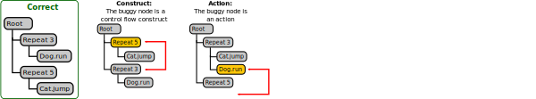
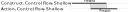

# Supplemental materials

## Bug type dimensions by example

### Dimension 1: Type of buggy node

### Dimension 2: Error type

### Dimension 3: Parenting error subtype

## Possible bug types

Not all combinations of dimensions are possible. Specifically, a **Plan Structure** error never has a parenting error subtype, since there is no parenting error; and conversely, an **Interaction** error always has a parenting error subtype, since there is necessarily some kind of parenting problem present.

The table below summarizes which combinations of **Error type** and **Parenting error subtype** are possible. This applies to errors on both **Action** and **Costruct** nodes, making a total of 20 possible combinations.

|  | Shallow | Deep | Permutation | Other | None |
|--|:-------:|:----:|:-----------:|:-----:|:----:|
| **Plan Structure** | | | | | :heavy_check_mark: |
| **Control Flow** | :heavy_check_mark: | :heavy_check_mark: | :heavy_check_mark: | :heavy_check_mark: | :heavy_check_mark: |
| **Interaction** | :heavy_check_mark: | :heavy_check_mark: | :heavy_check_mark: | :heavy_check_mark: | |

## Features for predictive models

This section provides a more detailed description of the two kinds of features we used in the random forest models to predict **Abandonment chance** and **Tests To Fix** metrics. 

### Current state features

These features describe the bugs present in the current code state, the bugs present in the previously-tested version of the code, and notable actions the student took to get from one or the other. Specifically, these features consist of:
-  A boolean flag for each of the 20 bug types in the bug taxonomy: are any bugs of this type currently present in the student code?
- A similar set of boolean flag which describes the bug types present the \textit{previous} time the student tested a solution to this puzzle (if any)
- The total number of bugs present in the current code state
- The total number of bugs present in the \textit{previous} tested code state
- The number of edits the student made in between this code test and the previous one (or since the start of the puzzle, if this is the first time they tested their code)
- The fraction of code edits in which a line of code was moved from the correct position to a wrong one. Such edits happen more frequently when a student is blaming a bug on the wrong line of code, or moving code around in a trial-and-error fashion.
- A set of three flags to describe changes in bug status between the current code state and the previous one:
  - Added a bug: a line of code was not buggy in the previous state (it was either correct or missing), but is buggy in the current state
  - Removed a bug: a line of code was buggy in the previous state, and is not buggy in the current state
  - Mutated a bug: a line of code was buggy in both the previous state and the current state, but the bug type has changed.

### Temporal patterns

In temporal pattern data mining, 
multivariate time-series data are represented as a set of time intervals: each interval is a period of time when some feature remained in a particular state. In our case, these are intervals of times when a certain type of bug was present in the student code. We further distinguished between intervals of time when **one** instance of a bug type was present and intervals where **multiple** bugs of that same type was present.  

These time interval data are mined for common patterns in temporal relationships between intervals. Two intervals may **overlap** in time, **meet** (one starts exactly when the other ends), or be completely disjoint, with the first interval occurring **before** the other one.

#### Example temporal patterns
We found 92 temporal patterns which were common in student code, and used each as a boolean feature in the difficulty models (was this pattern ever present in this student's attempt so far?).

Below are some represenative examples of the common temporal patterns we found.

##### Example 1: meets

In this example, an interval where a bug of type (Action, Control Flow, Shallow) is present **meets** an interval where a bug of type (Action, Interaction, Shallow) is present. Each time point in our temporal data corresponds to a single student action. Therefore, this temporal pattern can only happen when the student makes a single code edit that changes some bug from being of type (Action, Control Flow, Shallow) to (Action, Interaction, Shallow).

##### Example 2: overlaps

In this example, an interval for bug type (Construct, Control Flow, Shallow) **overlaps** an interval for (Action, Control Flow, Shallow). This temporal pattern means that (Construct, Control Flow, Shallow) bug was made first, then an (Action, Control Flow, Shallow) bug was added before the first (Construct) bug was fixed. The temporal pattern does not actually specify what order the overlapping bugs were fixed in; any kind of overlap counts.

##### Example 3: complex repetition of a bug

This example shows a complex temporal pattern which involves just one bug type, (Action, Interaction, Shallow). First a bug of that type is made, then it is resolved but some time later made again; then more bugs of that type are made (the interval type changes from "present" to "multiple"), and subsequently all but one of these bugs are resolved (the interval type changes back to "present").

## TODO

- Discussion/feature importance
- examples of important bug types
